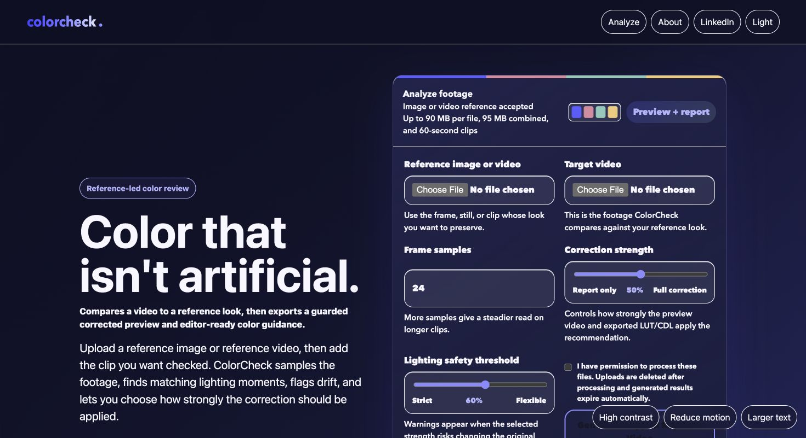
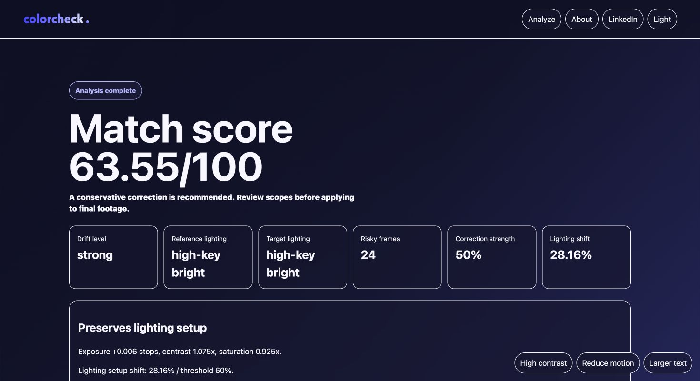
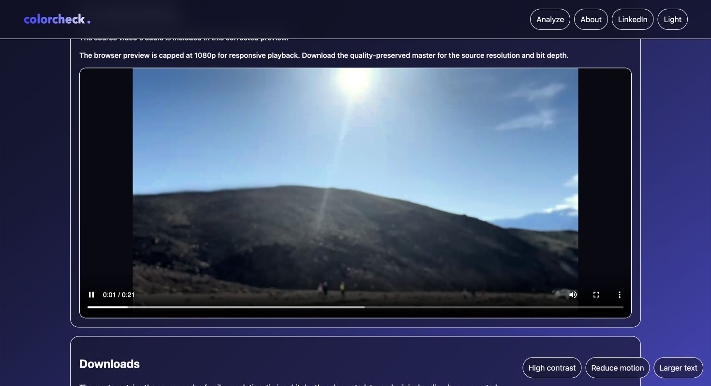
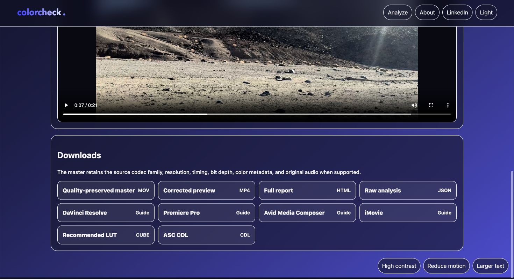

# ColorCheck

[](https://github.com/adeshp32/colorcheck/actions/workflows/ci.yml)

Reference-aware, guardrail-first video color intelligence for editors.

[Open ColorCheck](https://colorcheck.adideshpande.dev/)

ColorCheck compares target footage with an image or video reference, measures perceptual color and lighting drift with OpenCV and NumPy, and produces conservative corrections without modifying the source. It combines local frame selection, persistent background analysis, interactive editing, streamed video exports, LUT/CDL files, structured reports, and workflow guidance for DaVinci Resolve, Premiere Pro, Avid Media Composer, and iMovie.

<sub><strong>Reference-led analysis</strong></sub><br>


<sub><strong>Guardrail summary</strong></sub><br>


<sub><strong>Corrected preview</strong></sub><br>


<sub><strong>Editor-ready exports</strong></sub><br>


## Capabilities

- Match target frames against a still or lighting-similar moments from a reference clip.
- Measure structural similarity, perceptual color distance, luminance, contrast, saturation, and temperature drift.
- Recommend bounded exposure, contrast, saturation, and channel-balance adjustments.
- Let editors control correction strength and define a lighting-preservation threshold.
- Preserve source audio in the H.264 preview when an audio stream is present.
- Preserve supported codec, resolution, timing, bit depth, color metadata, and audio characteristics in the editing master.
- Use Apple VideoToolbox automatically on native macOS for high-fidelity hardware encoding, with portable software fallbacks.
- Export individual CUBE, CDL, JSON, HTML, MP4, MOV, and editor-guide files.

## Architecture

```text
src/colorcheck/
|-- analysis/   # Perceptual metrics, correction logic, and orchestration
|-- exports/    # Video, LUT, report, and editor-guide generation
|-- web/        # FastAPI routes, browser pages, and upload security
|-- config.py   # Environment-backed runtime limits
|-- models.py   # Shared typed domain models
`-- cli.py      # Command-line entry point
```

The dependency direction is intentionally simple: interfaces call the analysis pipeline, the pipeline coordinates domain logic and exporters, and lower-level modules never depend on the web layer. See [Architecture](docs/architecture.md) for the complete request and data lifecycle.

## Quick Start

Requirements: Python 3.11 or newer and FFmpeg.

```bash
python3.12 -m venv .venv
source .venv/bin/activate
python -m pip install --upgrade pip
python -m pip install -e ".[dev]"
```

Start the web application:

```bash
uvicorn colorcheck.web.app:app --reload --host 127.0.0.1 --port 8000
```

Open `http://127.0.0.1:8000`.

Run the CLI:

```bash
colorcheck \
  --reference path/to/reference.jpg \
  --video path/to/video.mp4 \
  --out reports/demo \
  --strength 50 \
  --lighting-threshold 60
```

Run with Docker:

```bash
docker compose up --build
```

## Output Contract

| File | Purpose |
| --- | --- |
| On-demand review MP4 | Browser-compatible H.264 export, capped at 1080p, with source audio when available |
| On-demand editing master | Full-resolution export preserving the source codec family, pixel format, color metadata, and untrimmed audio where supported |
| `recommended_correction.cube` | Portable 3D LUT |
| `recommended_correction.cdl` | ASC CDL correction values |
| `report.html` | Human-readable analysis |
| `report.json` | Structured analysis data |
| `*_steps.md` | Editor-specific application guidance |

Video pixels must be re-encoded after correction, so a corrected file cannot be bit-for-bit identical to the source. ColorCheck never modifies the original upload.

Trimming, crop, text, lighting mode, color-wheel tint, B&W, and mapped correction are composed into one FFmpeg render. The result streams directly to the browser and is never written to server storage. See the reproducible [performance notes](docs/performance.md) for benchmark and fidelity details.

## Safety Model

- Exposure is capped at approximately 0.35 stops.
- Contrast and saturation multipliers remain between 0.85 and 1.15.
- Per-channel balance remains between 0.92 and 1.08.
- Lighting-shift and clipping-risk checks warn before a correction becomes destructive.
- Source uploads receive generic internal names and are deleted after analysis or as soon as an export stream ends.
- Corrected video is never stored; temporary reports expire automatically and use unguessable job identifiers.
- Upload size, duration, resolution, request rate, and processing concurrency are bounded.
- The release container runs as a non-root user with a read-only filesystem and no Linux capabilities.

Read the [security policy](.github/SECURITY.md) and [privacy notes](docs/privacy.md) before operating a public instance.

## Verification

```bash
ruff check src tests
pytest -q
docker build -t colorcheck:local .
```

GitHub Actions runs the lint and test suite on every push and pull request. Dependabot checks Python, Docker, and GitHub Actions dependencies weekly.

## Deployment

The planned free public deployment runs the existing container on an Oracle Cloud Always Free
Ampere VM and publishes the custom domain through Cloudflare Tunnel. The origin remains private,
while Cloudflare provides HTTPS, DNS, DDoS protection, and the public hostname. Analysis is
queued persistently and full-resolution rendering is intentionally limited to one export at a
time on the free VM. See the
[deployment guide](docs/deployment.md) for the public upload ceiling, domain route, and security
checklist.

Kubernetes manifests are available in [`deploy/kubernetes`](deploy/kubernetes):

```bash
docker build -t colorcheck:local .
kubectl apply -f deploy/kubernetes/
kubectl port-forward service/colorcheck 8000:80
```
